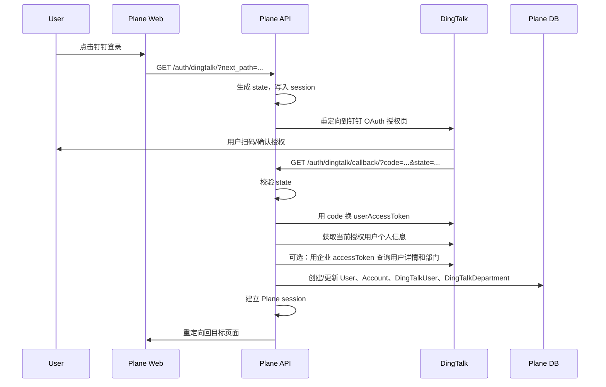

# DingTalk 授权登录与组织信息同步设计文档

状态：Draft  
分支：`feature/dingtalk-login`  
目标版本：Plane CE `1.3.1`

## 1. 背景

当前 Plane CE 已支持邮箱密码、Magic Link、Google、GitHub、GitLab、Gitea 等登录方式，但没有钉钉登录。为了适配国内企业内部使用场景，需要新增钉钉授权登录，并在用户授权后把钉钉返回的用户、部门等组织信息同步到 Plane 数据库。

本设计优先实现企业内部应用场景：

- 用户在 Plane 登录页点击“钉钉登录”。
- 跳转到钉钉 OAuth 授权页。
- 回调后 Plane 创建或更新本地用户。
- 同步当前授权用户的钉钉身份、部门、职位、手机号等信息，并按姓名生成 Handa 内部邮箱。
- 可选地同步企业通讯录部门树和部门成员，用于后续自动加入工作区、权限分组或项目成员映射。

## 2. 参考文档

以钉钉开放平台官方文档为准：

- [获取登录用户的访问凭证](https://open.dingtalk.com/document/orgapp-server/obtain-identity-credentials)
- [获取用户 token](https://open.dingtalk.com/document/development/obtain-user-token)
- [获取用户通讯录个人信息](https://open.dingtalk.com/document/development/dingtalk-retrieve-user-information)
- [获取企业内部应用的 accessToken](https://open.dingtalk.com/document/development/obtain-the-access-token-of-an-internal-app)
- [查询用户详情](https://open.dingtalk.com/document/development/query-user-details)
- [获取部门列表](https://open.dingtalk.com/document/development/user-management-acquires-the-list-departments)
- [获取部门用户基础信息](https://open.dingtalk.com/document/development/queries-the-simple-information-of-a-department-user)
- [获取部门用户详情](https://open.dingtalk.com/document/development/queries-the-complete-information-of-a-department-user)

## 3. 功能范围

### 3.1 本期实现

1. 新增钉钉 OAuth 登录入口。
2. 支持 God mode 配置钉钉登录开关和应用凭证。
3. 授权回调后自动创建或登录 Plane 用户。
4. 保存钉钉账号与 Plane 用户的绑定关系。
5. 同步授权用户的通讯录信息到本地扩展表。
6. 同步用户所属部门到本地扩展表。
7. 支持幂等更新：同一个钉钉用户多次登录不会重复创建 Plane 用户或部门。

### 3.2 后续增强

1. 全量同步企业通讯录部门树。
2. 全量同步部门成员。
3. 定时增量同步。
4. 基于部门自动加入 Plane workspace。
5. 基于部门或岗位映射 Plane 角色。
6. 用户离职/停用同步。

## 4. 钉钉应用配置

在钉钉开发者后台创建企业内部应用，并配置：

### 4.1 基础信息

- 应用类型：企业内部应用
- 登录回调地址：
  - 本地开发：`http://localhost:8000/auth/dingtalk/callback/`
  - Docker 部署：`http://localhost:8082/auth/dingtalk/callback/`
  - 生产环境：`https://<your-domain>/auth/dingtalk/callback/`

### 4.2 应用凭证

需要保存到 Plane 配置：

- `DINGTALK_CLIENT_ID`：钉钉 Client ID / AppKey
- `DINGTALK_CLIENT_SECRET`：钉钉 Client Secret / AppSecret
- `DINGTALK_REDIRECT_URI`：可选；钉钉授权回调地址覆盖值，留空时自动使用当前 Plane 域名下的 `/auth/dingtalk/callback/`
- `IS_DINGTALK_ENABLED`：是否启用钉钉登录
- `ENABLE_DINGTALK_SYNC`：是否在登录时同步用户资料
- `ENABLE_DINGTALK_CONTACT_SYNC`：是否允许同步企业通讯录

### 4.3 权限要求

最小权限：

- OAuth 授权登录
- 获取登录用户通讯录个人信息

同步部门和成员时需要额外申请：

- 通讯录部门读取权限
- 通讯录成员读取权限
- 手机号、邮箱等敏感字段读取权限按需申请

注意：手机号、邮箱等字段受权限控制，不保证所有企业都能返回。实现时必须允许字段为空。

## 5. 登录流程

### 5.1 时序



### 5.2 授权地址

新增 Provider 生成授权地址：

```text
https://login.dingtalk.com/oauth2/auth
```

建议参数：

```text
redirect_uri=<urlencoded callback url>
response_type=code
client_id=<DINGTALK_CLIENT_ID>
scope=openid corpid
state=<random csrf token>
prompt=consent
```

`scope` 建议包含 `openid corpid`，这样后续可拿到用户身份和授权时选择的组织信息。

### 5.3 回调处理

回调地址：

```text
GET /auth/dingtalk/callback/
```

处理步骤：

1. 读取 `code` 和 `state`。
2. 校验 `state == request.session["state"]`。
3. 调用钉钉用户 token 接口，用授权码换取 `accessToken`。
4. 使用用户级 `accessToken` 调用当前授权用户个人信息接口。
5. 根据返回的 `unionId/openId/userId/email/mobile` 匹配本地账号。
6. 创建或更新 Plane 用户。
7. 保存钉钉账号绑定关系。
8. 若开启同步，继续查询用户详情和部门信息。
9. 调用 Plane `user_login` 完成登录。

## 6. Plane 代码改动点

### 6.1 后端 OAuth Provider

新增：

```text
apps/api/plane/authentication/provider/oauth/dingtalk.py
```

参考：

```text
apps/api/plane/authentication/provider/oauth/google.py
apps/api/plane/authentication/provider/oauth/gitea.py
```

核心类：

```python
class DingTalkOAuthProvider(OauthAdapter):
    provider = "dingtalk"
    auth_url = "https://login.dingtalk.com/oauth2/auth"
    token_url = "https://api.dingtalk.com/v1.0/oauth2/userAccessToken"
    userinfo_url = "https://api.dingtalk.com/v1.0/contact/users/me"
```

注意：现有 `OauthAdapter.get_user_token()` 默认用表单方式提交，钉钉新接口使用 JSON body。因此 `DingTalkOAuthProvider` 需要覆写 `set_token_data()` 或新增 JSON 请求方法。

### 6.2 后端 View

新增：

```text
apps/api/plane/authentication/views/app/dingtalk.py
apps/api/plane/authentication/views/space/dingtalk.py
```

如果 Space 暂不支持，可先只实现 App 登录入口。

### 6.3 URL 注册

修改：

```text
apps/api/plane/authentication/urls.py
```

新增：

```python
path("dingtalk/", DingTalkOauthInitiateEndpoint.as_view(), name="dingtalk-initiate")
path("dingtalk/callback/", DingTalkCallbackEndpoint.as_view(), name="dingtalk-callback")
```

### 6.4 错误码

修改：

```text
apps/api/plane/authentication/adapter/error.py
```

新增：

```python
"DINGTALK_NOT_CONFIGURED": <new_code>
"DINGTALK_OAUTH_PROVIDER_ERROR": <new_code>
```

同时修改：

```text
apps/api/plane/authentication/adapter/oauth.py
```

在 `authentication_error_code()` 中支持 `dingtalk`。

### 6.5 配置项

修改：

```text
apps/api/plane/utils/instance_config_variables/core.py
apps/api/plane/license/api/views/instance.py
packages/types/src/instance/base.ts
packages/types/src/instance/auth.ts
```

新增配置：

```text
IS_DINGTALK_ENABLED
DINGTALK_CLIENT_ID
DINGTALK_CLIENT_SECRET
DINGTALK_REDIRECT_URI
ENABLE_DINGTALK_SYNC
ENABLE_DINGTALK_CONTACT_SYNC
```

### 6.6 前端登录按钮

修改：

```text
apps/web/core/hooks/oauth/core.tsx
```

新增 OAuth 选项：

```tsx
{
  id: "dingtalk",
  text: `${oauthActionText} with DingTalk`,
  icon: ,
  onClick: () => {
    window.location.assign(`${API_BASE_URL}/auth/dingtalk/${next_path ? `?next_path=${next_path}` : ``}`);
  },
  enabled: config?.is_dingtalk_enabled,
}
```

### 6.7 God mode 配置页

修改：

```text
apps/admin/hooks/oauth/core.tsx
apps/admin/hooks/oauth/index.ts
apps/admin/app/routes.ts
apps/admin/components/authentication/
apps/admin/app/(all)/(dashboard)/authentication/
```

新增钉钉配置页：

```text
apps/admin/app/(all)/(dashboard)/authentication/dingtalk/page.tsx
apps/admin/app/(all)/(dashboard)/authentication/dingtalk/form.tsx
apps/admin/components/authentication/dingtalk-config.tsx
```

## 7. 数据库设计

### 7.1 复用现有表

Plane 现有用户表：

- `users`
- `profiles`
- `accounts`

钉钉登录后：

- `users.email`：优先使用钉钉姓名拼音生成 Handa 邮箱，例如 `王小明 -> wangxiaoming@handa.com`。
- `users.mobile_number`：保存钉钉手机号。
- `users.first_name` / `users.display_name`：保存钉钉姓名或昵称。
- `accounts.provider`：保存 `dingtalk`。
- `accounts.provider_account_id`：优先保存钉钉 `unionId`，没有则保存 `openId/userId`。
- `accounts.metadata`：保存 `corpId/openId/unionId/userId` 等非敏感元数据。

注意：如果钉钉没有返回邮箱，不能直接创建没有邮箱的 Plane 用户，因为当前 `User.USERNAME_FIELD = "email"`，并且 `email` 唯一。建议策略见 8.1。

### 7.2 新增钉钉部门表

新增模型建议：

```text
DingTalkDepartment
```

建议字段：

| 字段 | 类型 | 说明 |
| --- | --- | --- |
| `id` | UUID | Plane 主键 |
| `corp_id` | CharField | 钉钉企业 ID |
| `dept_id` | CharField | 钉钉部门 ID |
| `parent_dept_id` | CharField, nullable | 父部门 ID |
| `name` | CharField | 部门名称 |
| `raw_data` | JSONField | 钉钉原始返回 |
| `last_synced_at` | DateTimeField | 最近同步时间 |
| `is_active` | BooleanField | 是否有效 |

唯一约束：

```text
(corp_id, dept_id)
```

### 7.3 新增钉钉用户扩展表

新增模型建议：

```text
DingTalkUser
```

建议字段：

| 字段 | 类型 | 说明 |
| --- | --- | --- |
| `id` | UUID | Plane 主键 |
| `user` | ForeignKey(User) | Plane 用户 |
| `corp_id` | CharField | 钉钉企业 ID |
| `union_id` | CharField | 钉钉 unionId |
| `open_id` | CharField, nullable | 钉钉 openId |
| `dingtalk_user_id` | CharField, nullable | 钉钉企业内 userId |
| `name` | CharField | 钉钉姓名 |
| `nick` | CharField, nullable | 钉钉昵称 |
| `mobile` | CharField, nullable | 手机号 |
| `email` | CharField, nullable | 邮箱 |
| `avatar_url` | TextField, nullable | 头像 |
| `title` | CharField, nullable | 职位 |
| `raw_data` | JSONField | 钉钉原始返回 |
| `last_synced_at` | DateTimeField | 最近同步时间 |

唯一约束：

```text
(corp_id, union_id)
```

索引：

```text
union_id
dingtalk_user_id
mobile
email
```

### 7.4 新增钉钉用户部门关系表

新增模型建议：

```text
DingTalkUserDepartment
```

建议字段：

| 字段 | 类型 | 说明 |
| --- | --- | --- |
| `id` | UUID | Plane 主键 |
| `dingtalk_user` | ForeignKey(DingTalkUser) | 钉钉用户 |
| `department` | ForeignKey(DingTalkDepartment) | 钉钉部门 |
| `is_primary` | BooleanField | 是否主部门 |
| `raw_data` | JSONField | 关系原始信息 |

唯一约束：

```text
(dingtalk_user, department)
```

## 8. 账号匹配策略

### 8.1 邮箱缺失处理

Plane 当前以邮箱作为主登录标识。钉钉企业通讯录未必返回邮箱，因此需要明确策略：

优先级：

1. 如果钉钉返回姓名，使用姓名拼音生成 Handa 邮箱：

```text
<name_pinyin>@handa.com
```

2. 如果本地已有 `DingTalkUser(corp_id, union_id)`，使用已绑定的 Plane 用户，并在同步开启时修正为 Handa 邮箱。
3. 如果无法生成 Handa 邮箱，才生成内部占位邮箱以满足 Plane 用户模型约束。

### 8.2 本地用户合并

创建用户前按以下顺序匹配：

1. `DingTalkUser(corp_id, union_id)`
2. `Account(provider="dingtalk", provider_account_id=union_id)`
3. `User.email == dingtalk_email`
4. `User.mobile_number == dingtalk_mobile`

如果第 3 或第 4 步命中已有用户，则创建钉钉绑定关系，不重复创建用户。

### 8.3 冲突处理

如果手机号命中 A 用户、邮箱命中 B 用户，且 A != B：

- 不自动合并。
- 登录失败并提示管理员处理。
- 后台记录冲突日志。

## 9. 同步策略

### 9.1 登录时同步

每次钉钉登录成功后同步当前用户：

1. 获取授权用户个人信息。
2. 若拿到企业 `corpId` 和 `userId`，使用企业 accessToken 查询用户详情。
3. 更新 `users`、`accounts`、`dingtalk_users`。
4. 更新用户所在部门：
   - upsert `dingtalk_departments`
   - upsert `dingtalk_user_departments`

登录时同步只处理当前登录用户，避免一次登录触发大规模通讯录同步。

### 9.2 手动全量同步

后续新增 God mode 操作：

```text
POST /api/instances/dingtalk/sync/
```

同步逻辑：

1. 获取企业 accessToken。
2. 从根部门 `dept_id=1` 开始广度优先遍历部门树。
3. 钉钉部门列表接口只返回当前部门的下一级部门，因此必须递归或队列遍历。
4. 对每个部门分页获取成员基础信息或详情。
5. upsert 部门、用户、用户部门关系。
6. 记录同步任务状态、耗时、失败数量。

### 9.3 定时同步

后续通过 worker/beat-worker 增加周期任务：

```text
dingtalk_contact_sync
```

建议频率：

- 小团队：每 6 小时一次
- 中大型团队：每天凌晨一次
- 登录时仍然同步当前用户，保证新登录用户信息及时更新

## 10. 钉钉接口封装

新增服务层：

```text
apps/api/plane/authentication/provider/oauth/dingtalk.py
apps/api/plane/integrations/dingtalk/client.py
apps/api/plane/integrations/dingtalk/sync.py
```

建议封装：

```python
class DingTalkClient:
    def get_user_access_token(self, code: str) -> dict:
        ...

    def get_org_access_token(self) -> dict:
        ...

    def get_me(self, user_access_token: str) -> dict:
        ...

    def get_user_detail(self, org_access_token: str, user_id: str) -> dict:
        ...

    def list_departments(self, org_access_token: str, parent_dept_id: str) -> list[dict]:
        ...

    def list_department_users(self, org_access_token: str, dept_id: str, cursor: int = 0) -> dict:
        ...
```

接口调用规范：

- 所有 HTTP 请求设置超时。
- 处理 429/限流，后续可加指数退避。
- token 缓存到内存或数据库，避免每次同步都重新获取。
- 不记录 `clientSecret/accessToken/refreshToken` 明文日志。

## 11. 安全设计

1. 必须校验 OAuth `state`，防止 CSRF。
2. `DINGTALK_CLIENT_SECRET` 必须加密存储，参考现有 `*_CLIENT_SECRET` 配置。
3. accessToken 和 refreshToken 只保存在 `accounts` 表，不输出到前端。
4. 日志中脱敏手机号、邮箱、token。
5. 钉钉头像 URL 属于外部输入，下载头像时继续复用现有 SSRF-safe avatar 下载逻辑。
6. 部门/用户同步接口仅允许 Instance Admin 调用。
7. 如果钉钉账号被停用，本期不自动停用 Plane 用户，避免误伤；后续通过全量同步策略控制。

## 12. 异常处理

| 场景 | 处理 |
| --- | --- |
| 未配置 AppKey/AppSecret | 重定向回登录页，提示钉钉未配置 |
| state 校验失败 | 拒绝登录 |
| code 过期或无效 | 重定向回登录页并提示重新授权 |
| 钉钉未返回邮箱 | 使用姓名拼音生成 `@handa.com` 邮箱，或绑定已有用户 |
| 手机号/邮箱绑定冲突 | 登录失败，提示联系管理员 |
| 通讯录权限不足 | 登录成功，但组织信息同步标记失败 |
| 部门接口分页失败 | 记录失败部门，继续同步其他部门 |
| 钉钉限流 | 延迟重试，超过阈值后标记同步失败 |

## 13. 测试计划

### 13.1 单元测试

- `DingTalkOAuthProvider` 正确生成授权 URL。
- `state` 校验失败时拒绝登录。
- token 接口异常时返回钉钉 OAuth 错误。
- 钉钉用户信息映射到 Plane user_data。
- 邮箱缺失时按姓名拼音生成稳定 Handa 邮箱。
- 重复登录不会重复创建用户。
- 同一个部门重复同步不会重复创建部门。

### 13.2 集成测试

- 使用 mock 钉钉接口跑完整登录流程。
- 模拟首次登录创建用户。
- 模拟已有邮箱用户绑定钉钉账号。
- 模拟已有钉钉绑定用户再次登录。
- 模拟部门树同步。

### 13.3 手工验收

1. God mode 可开启钉钉登录并保存配置。
2. 登录页出现“钉钉登录”按钮。
3. 点击后跳转钉钉授权页。
4. 授权成功后能进入 Plane。
5. 数据库 `accounts` 生成 `provider=dingtalk` 记录。
6. 数据库 `dingtalk_users` 写入 `corp_id/union_id/user_id/name/mobile/email`。
7. 数据库 `dingtalk_departments` 写入用户所属部门。
8. 再次登录只更新已有记录，不重复创建用户。

## 14. 开发顺序

建议按以下顺序实现：

1. 新增配置项和类型定义。
2. 新增后端 `DingTalkOAuthProvider`。
3. 新增后端 initiate/callback endpoint。
4. 新增错误码。
5. 新增前端登录按钮。
6. 新增 God mode 钉钉配置页面。
7. 新增数据库模型和 migration。
8. 登录成功后同步当前授权用户。
9. 增加单元测试。
10. 再做全量通讯录同步。

## 15. 未决问题

1. 是否允许没有邮箱的钉钉用户登录？
2. 占位邮箱是否接受 `@dingtalk.local`？
3. 钉钉部门是否需要映射到 Plane workspace/team/project role？
4. 首次钉钉登录是否自动创建 workspace？
5. 离职或禁用的钉钉用户是否要自动禁用 Plane 用户？
6. 需要支持多企业 `corpId` 同时登录吗？

## 16. 本期验收定义

本期完成后应达到：

- 管理员能在 God mode 配置钉钉登录。
- 普通用户能通过钉钉授权登录 Plane。
- 首次授权能创建 Plane 用户。
- 再次授权能复用已有用户。
- 授权后能把当前用户的钉钉身份和部门信息同步入库。
- 权限不足时不影响基础登录，但同步状态可追踪。
